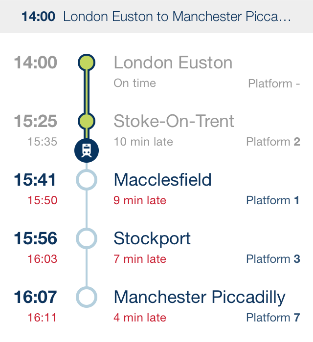

#React Train Schedule Representation

##Task
Using the supplied live departure board data, create a web page that faithfully reproduces the mock-up

###Assumptions

* Supplied actual, expected and scheduled times are departure times rather than arrival times
* Trains cannot depart earlier than scheduled
* Since arrival times or flags are not supplied, there is no requirement to represent the train being stopped at any of the stations other than the origin station. The train is assumed as being between two stations if the preceding station has a value for 'actual' and the following station has no value for 'actual'
* Since times are supplied as strings with no mention of date, catering for services that run over midnight is outside the scope of this prototype

##Languages & Tools
* Application code: JavaScript, React.js, HTML, CSS
* Testing: Karma, Webpack
* Boilerplate react configuration: react-hot-boilerplate <https://github.com/gaearon/react-hot-boilerplate>

##How to Run

###Prerequisites

Node v4.2.1 
npm v2.14.7

###Serve locally

1. Clone this repo (git clone https://bitbucket.org/ttl-engineering/repo_webdev_for_natalie.akam-gmail.com)
2. In terminal, go to the root of the folder and type the following commands into terminal
  1. npm install
  2. npm start
3. Navigate to localhost:3000 in your browser

Optional: Update the file **ldb.json** at the root of the directory to see the train change position!

###Run Tests
Type **npm test** into terminal

##Future Improvements
* Use date objects instead of strings to represent departure times
* Use either a flag or an arrival time to notify that a train has arrived in a station

##File Structure
    .
    ├── LICENSE
    ├── README.md
    ├── index.html
    ├── karma.conf.js
    ├── ldb.json
    ├── mockup.png
    ├── package.json
    ├── server.js
    ├── src
    │   ├── __tests__
    │   │   ├── calculate-mins-late-test.js
    │   │   ├── calling-point-test.js
    │   │   ├── calling-point-wrapper-test.js
    │   │   ├── departure-status-test.js
    │   │   ├── find-stop-position-test.js
    │   │   ├── get-statuses-test.js
    │   │   ├── journey-table-test.js
    │   │   ├── journey-title-test.js
    │   │   ├── map-test.js
    │   │   └── mocked-data.json
    │   ├── components
    │   │   ├── calculate-mins-late.js
    │   │   ├── calling-point-wrapper.js
    │   │   ├── calling-point.js
    │   │   ├── departure-status.js
    │   │   ├── find-stop-position.js
    │   │   ├── get-statuses.js
    │   │   ├── journey-table.js
    │   │   ├── journey-title.js
    │   │   └── map.js
    │   ├── images
    │   │   ├── first-not-visited.png
    │   │   ├── first-visited.png
    │   │   ├── last-not-visited.png
    │   │   ├── last-visited.png
    │   │   ├── not-visited.png
    │   │   ├── visited-midway.png
    │   │   └── visited.png
    │   ├── index.js
    │   └── style
    │       └── main.css
    ├── tests.webpack.js
    └── webpack.config.js
